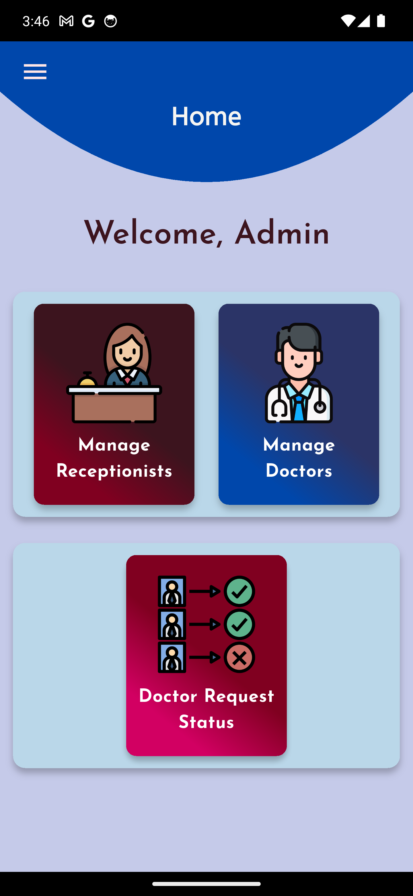
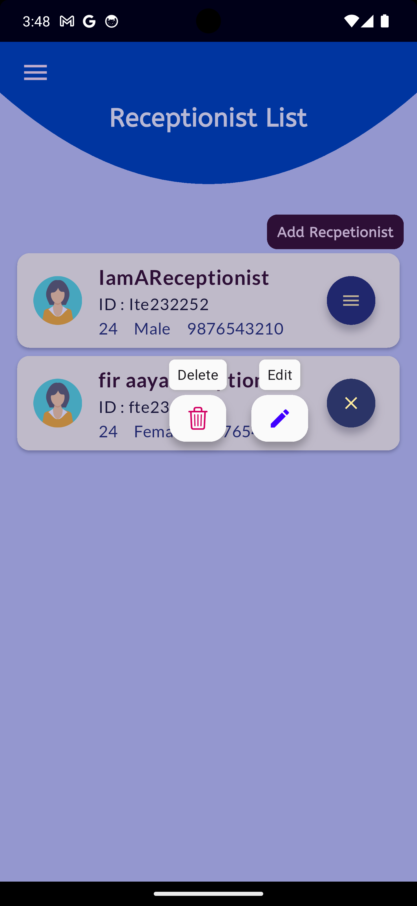
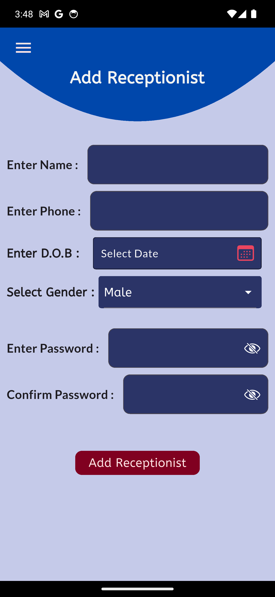
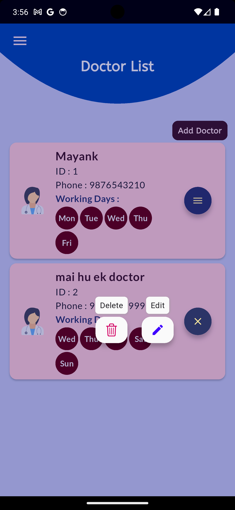
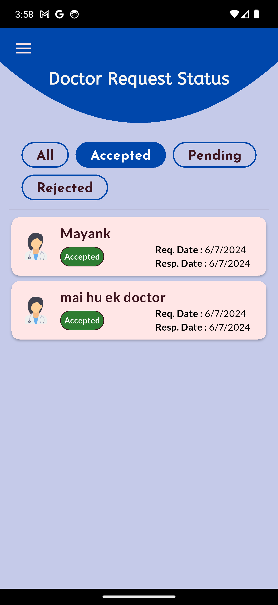
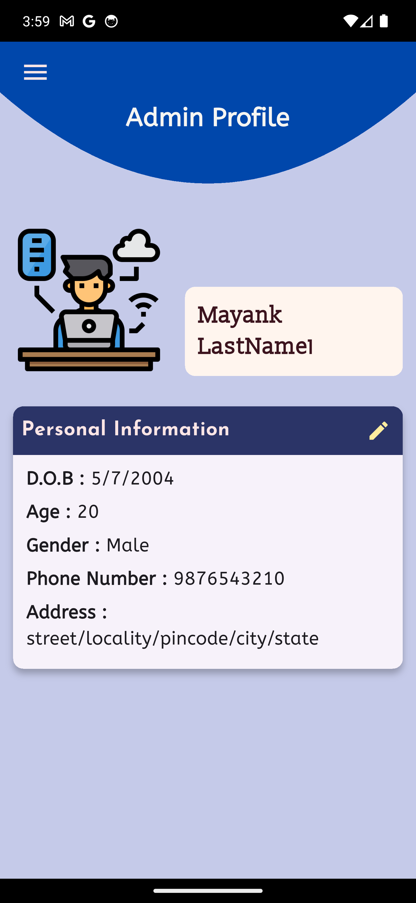

# HealthKa Admin

A comprehensive Flutter-based administrative panel for managing healthcare systems, providing efficient management of doctors, receptionists, and clinic operations.

---

## 🏥 Project Overview

HealthKaAdmin is a Flutter application designed to streamline healthcare administration through an intuitive web and mobile interface. The application provides centralized management capabilities for healthcare facilities, focusing on staff management and operational efficiency.

---
## 📑 Table of Contents

- [🏥 Project Overview](#-project-overview)
- [🖼️ Screenshots](#️-screenshots)
- [✨ Features](#-features)
  - [👨‍💼 Admin Management](#-admin-management)
  - [👩‍⚕️ Doctor Management](#-doctor-management)
  - [👩‍💻 Receptionist Management](#-receptionist-management)
- [🚀 Getting Started](#-getting-started)
  - [Prerequisites](#prerequisites)
  - [Installation](#installation)
- [🛠️ Tech Stack](#️-tech-stack)
  - [Frontend Framework](#frontend-framework)
  - [State Management](#state-management)
  - [Database & Storage](#database--storage)
  - [File System](#file-system)
  - [UI/UX Libraries](#uiux-libraries)
  - [Platform Support](#platform-support)
  - [Architecture Patterns](#architecture-patterns)
- [🏗️ Architecture](#-architecture)
- [📊 Database Schema](#-database-schema)

---
## 🖼️ Screenshots

<p>
  
  
  
  
  
  
</p>

## ✨ Features

### 👨‍💼 Admin Management
- **Admin Profile Management**: Complete admin profile creation and management
- **Dashboard Overview**: Centralized control panel for all operations

### 👩‍⚕️ Doctor Management
- **Add New Doctors**: Register new medical professionals
- **Doctor Status Tracking**: Monitor doctor availability and status
- **Manage Doctors**: Edit, update, and remove doctor profiles
- **Doctor Database**: Comprehensive storage and retrieval system

### 👩‍💻 Receptionist Management
- **Add Receptionists**: Register new reception staff
- **Manage Receptionists**: Complete CRUD operations for reception staff
- **Role-based Access**: Appropriate permissions for different user types
---

## 🚀 Getting Started

### Prerequisites
- Flutter SDK (>=3.4.3 <4.0.0)
- Dart SDK
- IDE (VS Code, Android Studio, or IntelliJ)

### Installation

1. **Clone the repository**
```
git clone https://github.com/mayankKushwaha13/healthKaAdmin.git
cd healthKaAdmin
```

2. **Install dependencies**
```
flutter pub get
```

3. **Run the application**
```
flutter run
```

---

## 🛠️ Tech Stack

### Frontend Framework
- **Flutter**  
- **Dart**  

### State Management
- **GetX** (`^4.6.6`)  

### Database & Storage
- **SQLite** (via `sqflite` `^2.3.3+1`)  
- **Shared Preferences** (`^2.2.3`)  

### File System
- **path_provider** (`^2.1.3`)  
- **path** (`^1.9.0`)  

### UI/UX Libraries
- **Google Fonts** (`^6.2.1`)  
- **Flutter Speed Dial** (`^7.0.0`)  
- **Cupertino Icons** (`^1.0.8`)  

### Platform Support
- **Android** - Native support
- **iOS** - Native support

---

## 🏗️ Architecture

The application follows a clean architecture pattern with clear separation of concerns:

- **Models**: Data structures representing core entities (Admin, Doctor, Receptionist)
- **Data Layer**: Database operations, shared preferences, and data management
- **Business Logic**: Functions for processing and manipulating data
- **Presentation Layer**: UI screens and reusable widgets

---

## 📊 Database Schema

The application uses SQLite for local data storage with tables for:
- **Admins**: Administrative user accounts
- **Doctors**: Medical professional profiles
- **Receptionists**: Reception staff information

---

**Note**: This is a Flutter-based healthcare administration system designed for managing clinic operations efficiently. The application provides a comprehensive solution for healthcare facilities to manage their staff and operations through an intuitive interface.
